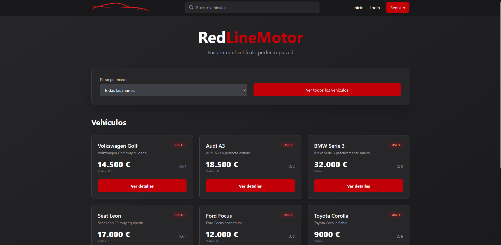
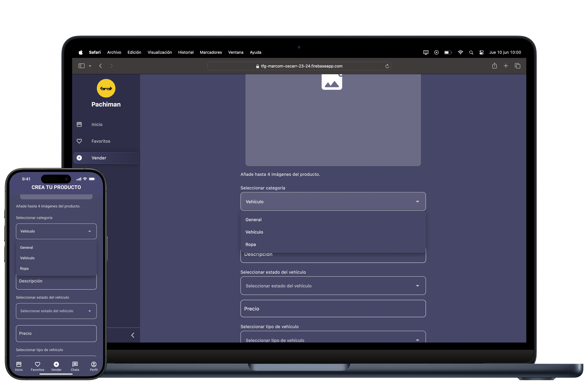
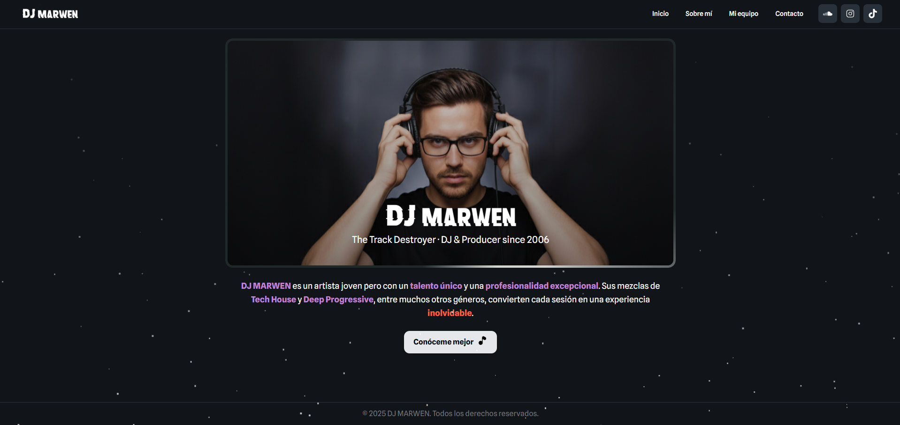
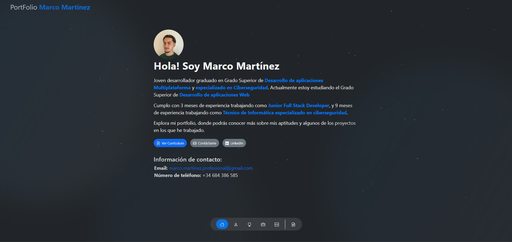

# Marco Martínez

**Full Stack Developer** · Java / Spring Boot · React / TypeScript · IoT

Software developer (DAM & DAW) focused on building complete products: REST APIs, web and mobile clients, databases, and connected hardware. I like projects that go from the sensor to the dashboard.

📍 Spain · 🌍 English B2 · 📬 Open to Full Stack / Backend roles

---

## Tech Stack

**Backend**

**Frontend & Mobile**

**Data**

**IoT & Tooling**

---

## Featured Projects

### RedLineMotor — Final Degree Project (DAW)

Full web application built as a three-person team: requirements analysis, frontend, backend, database design and Git-based collaboration.

- Built with **TypeScript** <!-- añade aquí el stack real: React? Node? Supabase? -->
- End-to-end feature development, from data model to UI
- Agile teamwork with branches, pull requests and code review

**Repository:** [tfg_jmn_25_26](https://github.com/MartinezDelAlamoMarco/tfg_jmn_25_26)

---

### SecondLife Hub — Second-hand Marketplace

Final Degree Project for DAM, graded **10/10**.

- Mobile app built with **Flutter & Firebase**
- Real-time database, user authentication and listing management
- Designed and delivered in pairs under academic supervision

**Repository:** [tfg_marco_oscar_2023_2024](https://github.com/MartinezDelAlamoMarco/tfg_marco_oscar_2023_2024)

---

### dj-marwen — Client Website

Portfolio site built for a DJ with **React + TypeScript + Vite**.

- Responsive SPA with animated navigation
- Image gallery and working contact form backed by a Node.js API
- Modular structure, deployed on Firebase Hosting

**Repository:** [dj-marwen](https://github.com/MartinezDelAlamoMarco/dj-marwen) · **Live:** [sample-dj-web.web.app](https://sample-dj-web.web.app/)

---

### Personal Portfolio

React site presenting my work, stack and background.

**Repository:** [portfolio](https://github.com/MartinezDelAlamoMarco/portfolio) · **Live:** [portfolio-marcom.web.app](https://portfolio-marcom.web.app/)

---

## Currently Building

**Home automation / mini-SCADA** — a layered DIY system to monitor sensors and control actuators at home: ESP32 nodes publishing over MQTT, a backend service, persistent storage and a dashboard. It is where I combine backend work with real hardware.

<!-- Si tienes capturas del dashboard o del montaje, añádelas aquí: valen más que el texto. -->

---

## GitHub Stats

---

## Get in Touch

- **Email:** marco.martinez.profesional@gmail.com
- **LinkedIn:** [in/marco-martinez-alamo](https://www.linkedin.com/in/marco-martinez-alamo/)
- **Portfolio:** [portfolio-marcom.web.app](https://portfolio-marcom.web.app/)

Outside of work: simracing and Minecraft survival worlds that get far more architecture than they need.
